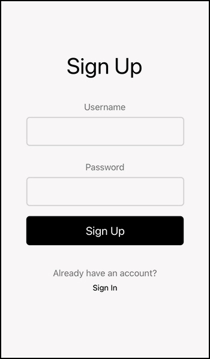

React Native Firebase Authentication Starter
=====================================



Sign up and sign in screens for mobile using React Native.
This is an example of how to use Firebase Authentication in React Native application, how to let users create an account or log in to an existing account.

Get Started
----------

1. In the terminal clone the repo `git clone [repolink]`.
2. In the terminal go to the root directory of the app.
3. Run `npx expo install` to install dependencies.
4. Run `npx expo start` to run the application.
5. Make sure you have the Expo app installed on your phone.
6. Scan the QR code with your phone camera or with QR scanner.
7. That's it, the app should open the expo app and run the app on your phone.

How to use
----------

1. Create a Firebase account.
2. Create an app inside of Firebase.
3. Go to the app / project settings and find the configurations like below.


```
const firebaseConfig = {
  apiKey: "Z39Anp432McbPkLrURA",
  authDomain: "appname.firebaseapp.com",
  projectId: "appname",
  storageBucket: "appname.appspot.com",
  messagingSenderId: "9124367852",
  appId: "1:111283728:web:8f77777986"
};
```
4. Update the `firebase.js` with your settings  


Screens
------------

- Sign Up Screen
- Sign In Screen
- Sign Out Screen

To switch between screens in this example go to `App.js` and look for this code:
```
<SignUp user={currentUser} setUser={setCurrentUser} />
{/* <SignIn user={currentUser} setUser={setCurrentUser} /> */}
{/* <SignOut user={currentUser} /> */}
```

The sign up screen is what you'll see on the app first.
If you want to see the sign in screen just comment the signUp component and comment out the signIn component

Everything is working properly right after you update the firebase.js with your credentials.

#### Enjoy

*Author [Maor Tzabari](https://oritzio.com/)*
